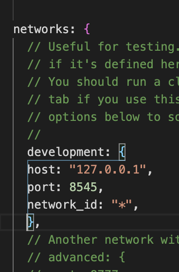

# Dapp to send ETH across Metamask accounts <br> using QR codes 🧞

 
- [Dapp to send ETH across Metamask accounts <br> using QR codes 🧞](#dapp-to-send-eth-across-metamask-accounts--using-qr-codes-)
  - [About](#about)
  - [Language requirements](#language-requirements)
  - [Development environments](#development-environments)
- [Getting started](#getting-started)
  - [1. Backend](#1-backend)
    - [Install Node.js](#install-nodejs)
    - [Create a Truffle project](#create-a-truffle-project)
    - [Create your smart contract](#create-your-smart-contract)
    - [Migrate your smart contract](#migrate-your-smart-contract)
    - [Set up a server](#set-up-a-server)
  - [2. Frontend](#2-frontend)
    - [Install the Web3.js API and Metamask](#install-the-web3js-api-and-metamask)
    - [Start a local blockchain using Ganache](#start-a-local-blockchain-using-ganache)
    - [Next, connect to our smart contract](#next-connect-to-our-smart-contract)
    - [Deploy your smart contract to your local blockchain](#deploy-your-smart-contract-to-your-local-blockchain)
    - [Interact with your smart contract](#interact-with-your-smart-contract)
    - [Test your smart contract](#test-your-smart-contract)
    - [Next, let's generate a base64 (string) that we then can transform into a QR code](#next-lets-generate-a-base64-string-that-we-then-can-transform-into-a-qr-code)
- [Usage](#usage)
  - [1. Start your local Ethereum blockchain](#1-start-your-local-ethereum-blockchain)
  - [2. Deploy your smart contract to the local blockchain](#2-deploy-your-smart-contract-to-the-local-blockchain)
  - [3. Start your server](#3-start-your-server)
  - [4. Interact with your Dapp in the browser](#4-interact-with-your-dapp-in-the-browser)
## About
<p> This Dapp constitutes a simple programme to send and receive ether (ETH) across Metamask wallets using QR codes.<br>
It consists of <br>

1. a **backend** with a single smart contract and a minimalistic server and,<br>
2. a **frontend** with a Web3 API and a basic web page from where we call the smart contract and display the corresponding QR code. <br>

**Author:** Moritz Dillmann <br>
**Institution:** University of Lausanne 

**Motivation:** <br>
This project aims to provide a *proof of concept* for using smart contracts in a _consumer CO2 compensation loyalty programme_ initiated by the Munich-based start-up <a href="https://imero.de/">IMERO GmbH</a>.</p>

##  Language requirements
1. **Backend:**
   1. Javascript
   2. Solidity (Ethereum smart contract)
   
2. **Frontend:**
   1. Javascript (web3 API)
   2. HTML

## Development environments
1. Smart contract development and testing:
<a href="https://www.trufflesuite.com/">Truffle</a> (v5.3.2) Ethereum development framework <br>

2. Setting up a local blockchain: <a href="https://www.trufflesuite.com/ganache">Ganache-CLI</a> (v6.12.2), (Ganache-Core: v2.13.2)<br>
   
3. Smart contract/ Dapp interaction in the browser: <a href="https://metamask.io/">Metamask wallet</a><br>

# Getting started

## 1. Backend
<p> We'll begin with the backend, which includes the development of our smart contract and the setup of a server.

### Install Node.js
<p> Node.js is an open-source, server-side JavaScript runtime environment that executes Javascript outside a browser. <br>
To learn more about Node.js, have a look at the <a href="https://nodejs.org/en/docs/">docs</a>. <br>
I recommend to install Node.js using its version manager <a href="https://github.com/nvm-sh/nvm">nvm</a>.</p>


1. Install <a href="https://nodejs.org/en/">node.js</a> (v14.17.0) together with its package manager, npm (v6.14.13) <br>

### Create a Truffle project

1. Create a new directory where you want your blockchain project to reside
   
2. Install <a href="https://www.trufflesuite.com/">Truffle</a> (v5.3.2)
   
3. Create a new Truffle project: <br>
    `truffle init` <br>
    (You can check all commands you can use with Truffle with: `truffle`)

### Create your smart contract
1. Create your smart contract in the _.contracts/_ directory: <br>
    `cd contracts` <br>
    `truffle create contract Trust.sol` <br>
    —> creates a new Solidity file 

2. Edit Smart Contract in your favourite Code Editor (e.g. Visual Studio Code). <br>
 <p> I created the smart contract for this Dapp, "Trust.sol", in <a href="http://remix.ethereum.org/">Remix IDE</a>. Remix is great when you are new to Solidity and it allows you to test your contract's functionality before you deploy it in your project.</p>

 ### Migrate your smart contract
 <p> Before we can deploy our new smart contract, we first have to _migrate_ it: </p>

 1. navigate to the _./migrations_ folder: <br>
    `ls migrations/` <br>
    Don’t modify the already existing migration file, Truffle needs it to use its migration feature.

2. create a migration file: <br>
    `truffle create migration Trust` <br>

    <p>  Truffle adds a random number to the name of your new migration file in order to know in what order it has to run the migration. </p>

3. 	Modify your new migration file in your text editor:
	1. copy the content from the _1_initial_migration.js_ file <br>
    2. then modify it as follows: <br>

        1. First, we import our smart contract of interest: <br>

        `var Trust = artifacts.require("./Trust.sol");` 

        2. Next, create a deployer (function) which calls the  method 'deploy': <br>
        <br>

            ```module.exports = function(deployer) {
                deployer.deploy(Trust, "This is my message")}; 
            ```
            
            This function will deploy the Trust.sol smart contract. <br>
            The smart contract is supposed to say the random string "This is my message" after it's deployed.

<p> Before we deploy our smart contract, "Trust.sol", we first need to do a few more steps. </p>

### Set up a server

1. Create a new directory named "server": <br>
    `mkdir server` <br>
    `cd server`

2. In the new directory, install Express (v4.17.1) <br>
    `npm install express --save`<br>

3. Install Cors  (v2.8.5) <br>
    `npm install cors`

4. Create a new file named "server.js": <br>
    `touch server.js`

5. In _server.js_, import Express and Cors: <br>
    ```
    // imports
    const express = require('express')
    var cors = require('cors')
    ```

1. Start a server and make it ready to connect at Port 3000 <br>
   
    ```
    const app = express()
    app.use(cors())
    const port = 3000

    app.listen(port, () => {
    console.log(`Example app listening at http://localhost:${port}`)
    })
    ```

2. Create a server interface (where we will later integrate the web3 API) <br>
    ```
    app.get('/generateqrcode', async (req, res) => {
        })
    ```

## 2. Frontend

### Install the Web3.js API and Metamask
<p> In a next step, we connect web3.js to our Truffle project to interact with our smart contract.
web3.js is a commonly used Ethereum Javascript API.
For details about the web3 library collection, look at the 
<a href="https://web3js.readthedocs.io/en/v1.3.4/#:~:text=Ethereum%20JavaScript%20API-,web3.,using%20HTTP%2C%20IPC%20or%20WebSocket.&text=js%20as%20well%20as%20providing%20an%20API%20reference%20documentation%20with%20examples">docs</a>.

1. Install web3.js (v1.3.6) <br>
    `npm install web3` <br>
    You can check your web3 version with: `npm view web3 version`

2. Import Web3 into your Truffle project. In _./server/server.js_,   import web3: <br>
    `const Web3 = require(‘web3’);` <br>
    —> now, you can use web3 with the ‘Web3’ _object_.

3. Install Metamask <a href="https://metamask.io/download">browser extension</a> and create an account.<br>
Extensions exist for Chrome, Firefox, Brave, and Edge.

4. In _server.js_, detect Metamask's web3 injection by updating the the server interface as follows: <br>

    ```
    app.get('/generateqrcode', async (req, res) => {
        
        // detect Metamask's web3 injection
        let web3;

        if (typeof web3 !== 'undefined') {
            init.web3Provider = web3.currentProvider;
            web3 = new Web3(web3.currentProvider);

        } else {
            // If no injected web3 instance is detected, fallback to Ganache.
            init.web3Provider = new web3.providers.HttpProvider('http://127.0.0.1:9545'); 
            web3 = new Web3(init.web3Provider);
        }
    });
    ```

5. Add a web3 instance for Metamask <br>
    <p> We now add a web3-"instance". This constitutes the so-called "provider" object which allows our Metamask wallet to communicate with our local blockchain. <br>

    `const web3 = new Web3('http://127.0.0.1:8545');` <br>

    <p>'http://127.0.0.1:8545' is the URL of localhost 8545.</p>

### Start a local blockchain using Ganache
1. Install ganache-cli <br>
   `npm install -g ganache-cli`

2. Check out the seed phrase of your Metamask wallet 
   1. In your Metamask wallet, go to Settings
   2. Go to Security & Privacy
   3. Click on “Reveal Seed Phrase”
   4. Copy the Seed Phrase to the Clipboard

3. Add the seed phrase to the following command in a new terminal tab: <br>

    `ganache-cli -m "<seed phrase>"` <br>

<p>This starts a local blockchain with 10 accounts of which each holds 100 fake ether.<br>

4. In Metamask, switch your network to Localhost 8545. <br>
    You can now see the ten new accounts in Metamask by going to your account page and clicking on the colourful account symbol. Then create 9 new accounts. All of them should hold 100 ether.</p>

### Next, connect to our smart contract
1. Import the smart contract, "Trust.sol" into _server.js_: <br>

    `const Trust = require('./build/contracts/Trust.json');` <br>

2. Next, add the following **into** the server interface function: <br>
    ```
    const id = await web3.eth.net.getId();
    const deployedNetwork = Trust.networks[id];
    ```

<p>With the web3 instance from above, we can now create a "contract instance", that will then interact with our smart contract.</p><br>

1. Create the contract instance by adding the following to your server interface in _server.js_:<br>
    ```
    const contract = new web3.eth.Contract(
        Trust.abi, 
        deployedNetwork.address 
    );
    ```
    <p>
    **Trust.abi** is a JSON document that describes all the functions that can be called from outside the blockchain. <br> **deployedNetwork.address** uniquely identifies our smart contract on the blockchain.<br>
    <br>

    Where to find the ‘abi’ and ‘address’ information?<br>
       1. Open a new terminal tab.
       2. Go to the _.contracts/_ folder in the build directory of the project.
       3. There you see all the **abis** that were created when we compiled our smart contract.
       4. Open the Trust.json file.
       5. This shows us all the (public) functions that are accessible from outside the smart contract.
       6. The contract address appears in the “networks” section of the Trust.json file (after we deployed our smart contract). 
        </p>

### Deploy your smart contract to your local blockchain

1. In the root directory, open the _truffle-config.js_ file and "comment in" the following: <br>
    

2. Open a new terminal and run the following command: <br>
    `truffle migrate --reset --network development` <br>

    <p> We can now see in Metamask that the first account already has a little bit less ETH because it pays for the deployment of the contract (and all other transactions on our blockchain). </p>

### Interact with your smart contract
<p> We can now interact with our smart contract by calling its functions. Here, we have to distinguish between Ethereum's call and transaction API. <br> 

**All code (i.e. 6 steps) in this Section is added to the server interface in _server.js_**:

1. Call a 'call' function of the smart contract using Ethereum's call API <br>
    ```
    const result = await contract.methods.admin().call(); 
    console.log("our admin is:", result);
    ```
    <p> This returns the account address of the supermarket, i.e. our admin (who also has to pay for all transaction costs). </p>

2. get the ten unlocked accounts of ganache <br>

    `const addresses = await web3.eth.getAccounts();`
    <p> This way, we do not have to write out the account addresses of interest, but can refer to them with "addresses[0], addresses[1], etc.</p>

3. Call a 'transaction' function of the smart contract using Ethereum's transaction API

    ```
    const receipt = await contract.methods.addCustomer(addresses[1], 0).send({
            from: addresses[0],
                value: web3.utils.toWei('1') //translates ETH to wei
                // alternative 1: value: '1000000000000000000' //wei
                // alternative 2: use BN library:
                // value: web3.utils.toBN('1000000000000000000')
        });
        console.log("receipt of admin's transaction to the smart contract", receipt); 
        // get receipt of the transaction (that your transaction was 
        // received by the blockchain and is being processed).
    ```
    <p> This sends 1 ETH from the supermarket to the account of the smart contract.</p>


4. Call a second 'call' function telling us the amount a customer is supposed to receive (msg.value) and whether she already received it (true/false)
    ```
    const result2 = await contract.methods.customers(addresses[1]).call();
        console.log("Status of the customer(s):", result2);
    ```

5. Call the second transaction function of our smart contract, "withdraw":
    ```
    const receipt2 = await contract.methods.withdraw().send({
        from: addresses[1]});
    console.log("Customer withdraws amount from contract:", receipt2);
    ```
    <p>With this call, our representative end-customer (adresses[1]) withdraws all ETH that is in the account of the smart contract, i.e. 1 ETH.</p>

6. Call a third 'call' function telling us the amount a customer is supposed to receive (msg.value) and whether she eventually received it (true/false):

    ```
    const result3 = await contract.methods.customers(addresses[1]).call();
    console.log("New status of the customer(s):", result3);
    ```


### Test your smart contract
1. run the following to execute your script: <br>
    `node server.js`

### Next, let's generate a base64 (string) that we then can transform into a QR code
<p> What we have now achieved from the command line we now want to pack into a QR code. </p>

<p> In _server.js_ :</p>

1. import a QR <a href="https://github.com/jibrelnetwork/ethereum-qr-code">code generator plugin</a> <br>

    ```
    // imports
    const EthereumQRPlugin = require("ethereum-qr-code");

    // QR code generator
    const qr = new EthereumQRPlugin();
    ```

2. Add the following into the server interface: 

    ```
    // generate QR code
        qr.toDataUrl({
            to: addresses[1], //required: recipient address
            from: "0xA0769D8100B85D3142Bc46F21C52Dc8BC18e9077", //optional, sender account. Defaults to current active user account.
            value: 1000000000000000000, //Amount of ETH to send. Measured in wei. Defaults to 0.
            gas: 21000, // optional - Recommended amount of gas. Defaults to 21000.
            
        }).then((qrCodeDataUri) => {
            // base64 image string
            myQR = qrCodeDataUri.dataURL;
            console.log('Your QR id generated:', myQR); //> 'data:image/png;base64,iVBORw0KGgoA....'
            res.send(myQR)
        });
    ```

3. Your final _server.js_ should now look as follows: 

```
// imports
const express = require('express');
var cors = require('cors');

const Web3 = require(‘web3’);
const Trust = require('./build/contracts/Trust.json');

// QR code generator plugin
const EthereumQRPlugin = require("ethereum-qr-code");
const qr = new EthereumQRPlugin();

// start server
const app = express()
app.use(cors())
const port = 3000

// server interface
app.get('/generateqrcode', async (req, res) => {
     
    // detect Metamask's web3 injection
    let web3;

    if (typeof web3 !== 'undefined') {
        init.web3Provider = web3.currentProvider;
        web3 = new Web3(web3.currentProvider);

    } else {
        // If no injected web3 instance is detected, fallback to Ganache.
        init.web3Provider = new web3.providers.HttpProvider('http://127.0.0.1:9545'); 
        web3 = new Web3(init.web3Provider);
    };

    // web3 instance for Metamask
    const web3 = new Web3('http://127.0.0.1:8545');

    const id = await web3.eth.net.getId();
    const deployedNetwork = Trust.networks[id];

    // create contract instance
    const contract = new web3.eth.Contract(
        Trust.abi, 
        deployedNetwork.address 
    );

    // interact with smart contract
    // first call to call API
    const result = await contract.methods.admin().call(); 
        console.log("our admin is:", result);

    const addresses = await web3.eth.getAccounts();

    // first call to transaction API
    const receipt = await contract.methods.addCustomer(addresses[1], 0).send({
        from: addresses[0],
            value: web3.utils.toWei('1') //translates ETH to wei
        });
        console.log("receipt of admin's transaction to the smart contract", receipt); 

    // second call to call API
    const result2 = await contract.methods.customers(addresses[1]).call();
        console.log("Status of the customer(s):", result2);

    // second call to transaction API
    const receipt2 = await contract.methods.withdraw().send({
        from: addresses[1]});
        console.log("Customer withdraws amount from contract:", receipt2);

    // third call to call API
    const result3 = await contract.methods.customers(addresses[1]).call();
        console.log("New status of the customer(s):", result3);

    // Generate QR Code
    qr.toDataUrl({
        to: addresses[1], 
        from: "0xA0769D8100B85D3142Bc46F21C52Dc8BC18e9077", //optional, defaults to current active user account
        value: 1000000000000000000, //Amount of ETH to send. Measured in wei. Defaults to 0.
        gas: 21000, // optional - Recommended amount of gas. Defaults to 21000.
            
    }).then((qrCodeDataUri) => {
        // base64 image string
        myQR = qrCodeDataUri.dataURL;
        console.log('Your QR id generated:', myQR); //> 'data:image/png;base64,iVBORw0KGgoA....'
        res.send(myQR)
    });
})

app.listen(port, () => {
console.log(`Example app listening at http://localhost:${port}`)
})
```
# Usage
<p> When you have everything installed as described above, do the following steps to use the Dapp.<br>
You can skip step 1. and step 2. when your local blockchain is still running and your smart contract is already deployed to it.<br>
</p>

## 1. Start your local Ethereum blockchain
`ganache-cli -m "<Metamask seed phrase>"`

## 2. Deploy your smart contract to the local blockchain
`truffle migrate --reset --network development`

## 3. Start your server
`cd server` <br>
`node server.js`

## 4. Interact with your Dapp in the browser
1. Open **index.html** in your browser. <br>
2. Click the "Click me!" button <br>
3. Scan the fresh QR code with your smartphone camera (and the Metamask app opens automatically) <br> 
   or with the built-in QR code scanner of the Metamask app.